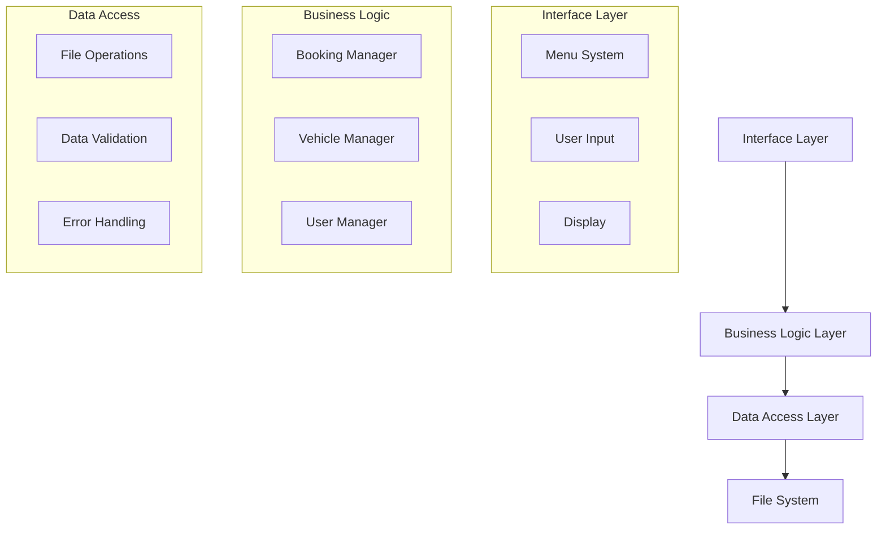

# Sistema di Car Sharing

## 👥 Autori
- **Andrea Rizzo** ([@Andry018](https://github.com/Andry018))
- **Giovanni Varricchio** ([@Ayamiba](https://github.com/Ayamiba))
- **Gabriele Vicinanza** ([@Gabrzzz](https://github.com/Gabrzzz))

## 📝 Descrizione
Un sistema completo di car sharing sviluppato in C che permette la gestione di veicoli, prenotazioni e utenti. Il sistema supporta ruoli differenziati (admin e utenti standard) e offre una gestione completa delle prenotazioni con persistenza dei dati.

## 📚 Documentazione
- [Guida Utente](docs/guida-utente.md)
- [Documentazione Tecnica](docs/documentazione-tecnica.md)
- [Struttura del Progetto](docs/struttura-progetto.md)
- [Componenti e API](docs/componenti-api.md)
- [Note di Sviluppo](docs/note-sviluppo.md)

## 🚀 Quick Start

### Requisiti
- Compilatore C (GCC raccomandato)
- Make/MinGW32-make per Windows

### Compilazione
```bash
# Su Linux/Mac
make

# Su Windows con MinGW
mingw32-make
```

### Esecuzione
```bash
# Su Linux/Mac
./car_sharing

# Su Windows
car_sharing.exe
```

Per maggiori dettagli, consultare la [Guida Utente](docs/guida-utente.md).

## 🚀 Funzionalità Principali

### 👥 Gestione Utenti
- **Registrazione utenti**
  - Creazione nuovo account
  - Assegnazione automatica ID
  - Gestione nome completo e nome_utente
- **Sistema di accesso**
  - Login con nome_utente
  - Supporto per ruoli (admin/utente standard)
  - Gestione sessione utente

### 🚗 Gestione Veicoli
- Aggiunta nuovi veicoli
- Rimozione veicoli esistenti
- Visualizzazione lista completa veicoli
- Persistenza dati su file

### 📅 Sistema di Prenotazioni
- **Creazione prenotazioni**
  - Selezione veicolo
  - Definizione periodo (giorno e ora inizio/fine)
  - Assegnazione priorità
- **Gestione stati prenotazione**
  - In attesa
  - Confermata
  - Completata
  - Cancellata
- **Funzionalità avanzate**
  - Visualizzazione disponibilità veicoli
  - Calendario prenotazioni
  - Gestione conflitti tramite priorità
  - Persistenza automatica delle modifiche

### 👨‍💼 Funzionalità Admin
- Gestione completa veicoli
- Modifica stato prenotazioni
- Creazione prenotazioni per altri utenti
- Accesso a tutte le prenotazioni

## 🛠️ Struttura del Progetto

### File Principali
- `main.c`: Entry point e gestione menu principale
- `prenotazioni.c/h`: Gestione sistema prenotazioni
- `vehicle.c/h`: Gestione veicoli
- `utenti.c/h`: Gestione utenti
- `fasceorarie.c/h`: Gestione calendario e disponibilità

### Directory
- `/src`: Codice sorgente
- `/data`: File di persistenza dati
  - `prenotazioni.txt`: Database prenotazioni
  - `utenti.txt`: Database utenti
  - `veicoli.txt`: Database veicoli

## 💾 Persistenza Dati
Il sistema mantiene tutti i dati persistenti attraverso file di testo:
- Salvataggio automatico dopo ogni modifica
- Caricamento all'avvio del programma
- Gestione robusta degli spazi nei nomi
- Backup finale alla chiusura

## 🎨 Interfaccia Utente
- Menu intuitivo e colorato
- Feedback visivo delle operazioni
- Gestione errori user-friendly
- Supporto multi-piattaforma per i colori

## 🔧 Compilazione ed Esecuzione

### Requisiti
- Compilatore C (GCC raccomandato)
- Make/MinGW32-make per Windows

### Compilazione
```bash
# Su Linux/Mac
make

# Su Windows con MinGW
mingw32-make
```

### Esecuzione
```bash
# Su Linux/Mac
./car_sharing

# Su Windows
car_sharing.exe
```

## 🔐 Sicurezza
- Validazione input utente
- Controllo permessi per operazioni sensibili
- Gestione sicura dei file di sistema
- Protezione accesso dati utente

## 👥 Gestione Utenti

### Utente Admin
- ID: 0
- Accesso completo al sistema
- Gestione utenti e veicoli
- Modifica stato prenotazioni

### Utente Standard
- ID > 0
- Gestione prenotazioni personali
- Visualizzazione disponibilità
- Modifica stato prenotazioni personali

## 📊 Sistema di Prenotazioni

### Stati Prenotazione
1. **In Attesa**: Prenotazione iniziale
2. **Confermata**: Approvata dall'admin
3. **Completata**: Servizio concluso
4. **Cancellata**: Prenotazione annullata

### Priorità
- Valore numerico (più basso = più prioritario)
- Gestione automatica conflitti
- Possibilità di override da admin

## 🤝 Best Practices Implementate
- Gestione memoria dinamica
- Controlli di sicurezza
- Validazione input
- Gestione errori robusta
- Codice modulare e mantenibile

## 🔄 Flusso di Lavoro Tipico

1. **Accesso al Sistema**
   - Login utente esistente
   - Registrazione nuovo utente

2. **Gestione Prenotazioni**
   - Visualizzazione disponibilità
   - Creazione prenotazione
   - Monitoraggio stato
   - Cancellazione se necessario

3. **Amministrazione**
   - Gestione veicoli
   - Conferma prenotazioni
   - Gestione utenti
   - Monitoraggio sistema

## 📈 Future Implementazioni Possibili
- Sistema di notifiche
- Interfaccia grafica
- Gestione pagamenti
- Sistema di recensioni
- Statistiche utilizzo
- API per integrazioni esterne

## 🐛 Risoluzione Problemi Comuni
1. **Errore accesso file**
   - Verificare permessi directory
   - Controllare esistenza file

2. **Problemi visualizzazione colori**
   - Verificare supporto terminale
   - Utilizzare flag compilazione appropriati

3. **Errori compilazione**
   - Verificare dipendenze
   - Controllare versione compilatore

## 📚 Note Tecniche
- Linguaggio: C standard
- Gestione memoria: Dinamica
- Strutture dati: Code priorità, Liste
- Sistema file: I/O standard C 

## 🔬 Dettagli Tecnici Approfonditi

### 📊 Motivazione della Scelta degli ADT

#### 1. Coda con Priorità (Heap Binario)
- **Motivazione**: Scelta ottimale per la gestione delle prenotazioni perché:
  - Accesso O(1) alla prenotazione più prioritaria
  - Inserimento e rimozione in O(log n)
  - Gestione naturale delle priorità delle prenotazioni
  - Efficiente per la risoluzione dei conflitti di prenotazione
- **Implementazione**: 
  ```c
  typedef struct {
      Prenotazione* heap;    // Array dinamico
      int capacita;
      int dimensione;
  } CodaPrenotazioni;
  ```

#### 2. Lista Concatenata per Veicoli
- **Motivazione**: Scelta ideale per la gestione del parco veicoli perché:
  - Dimensione dinamica efficiente
  - Inserimenti e rimozioni frequenti O(1)
  - Attraversamento sequenziale naturale per visualizzazione
  - Basso overhead di memoria
- **Implementazione**:
  ```c
  typedef struct node {
      Veicolo veicoli;
      struct node* next;
  } *list;
  ```

#### 3. Hash Table per Utenti
- **Motivazione**: Ottimale per la gestione utenti perché:
  - Accesso O(1) per login
  - Efficiente verifica duplicati nome_utente
  - Bilanciamento tra memoria e velocità
  - Scalabile per grandi numeri di utenti

### 🏗️ Progettazione del Sistema

#### Architettura a Livelli


#### Interazione tra Componenti
1. **Flusso Prenotazioni**
   ```mermaid
   sequenceDiagram
       participant U as User
       participant BM as Booking Manager
       participant VM as Vehicle Manager
       participant FS as File System
       
       U->>BM: Request Booking
       BM->>VM: Check Availability
       VM->>BM: Vehicle Status
       BM->>FS: Save Booking
       FS->>BM: Confirmation
       BM->>U: Booking Status
   ```

2. **Gestione Stati**
   ```mermaid
   stateDiagram-v2
       [*] --> InAttesa
       InAttesa --> Confermata
       Confermata --> Completata
       InAttesa --> Cancellata
       Confermata --> Cancellata
   ```

### 📋 Specifica Sintattica e Semantica

#### 1. Operazioni su CodaPrenotazioni

##### `inizializza_coda()`
- **Input**: Nessuno
- **Output**: `CodaPrenotazioni*`
- **Precondizioni**: Nessuna
- **Postcondizioni**: 
  - Coda vuota creata
  - Memoria allocata
  - capacita > 0
- **Effetti Collaterali**: Allocazione memoria

##### `aggiungi_prenotazione(CodaPrenotazioni* coda, Prenotazione p)`
- **Input**: 
  - coda: puntatore a coda valida
  - p: prenotazione da inserire
- **Output**: int (0 successo, -1 errore)
- **Precondizioni**:
  - coda != NULL
  - p con campi validi
- **Postcondizioni**:
  - Prenotazione inserita in posizione corretta
  - Proprietà heap mantenuta
- **Effetti Collaterali**: 
  - Possibile riallocazione memoria
  - Modifica file prenotazioni.txt

#### 2. Operazioni su Lista Veicoli

##### `aggiungi_veicolo(list l)`
- **Input**: lista esistente
- **Output**: nuova lista
- **Precondizioni**: memoria disponibile
- **Postcondizioni**: 
  - Veicolo aggiunto in testa
  - Collegamenti lista corretti
- **Effetti Collaterali**: 
  - Allocazione memoria
  - Aggiornamento file veicoli.txt

### 🧪 Razionale dei Casi di Test

#### 1. Test Unitari Prenotazioni
```c
// Test inserimento prenotazione
void test_inserimento_prenotazione() {
    CodaPrenotazioni* coda = inizializza_coda();
    Prenotazione p = crea_prenotazione(1, 1, 0, 10, 0, 12, 1);
    assert(aggiungi_prenotazione(coda, p) == 0);
    assert(coda->dimensione == 1);
    assert(coda->heap[0].id_prenotazione == p.id_prenotazione);
}
```

#### 2. Test di Integrazione
- **Scenario**: Prenotazione con conflitto
- **Obiettivo**: Verificare gestione priorità
- **Passi**:
  1. Inserire prenotazione A (priorità 2)
  2. Inserire prenotazione B (priorità 1) stesso orario
  3. Verificare ordinamento corretto

#### 3. Test di Sistema
- **Scenario**: Ciclo completo prenotazione
- **Obiettivo**: Verificare flusso end-to-end
- **Copertura**:
  - Login utente
  - Creazione prenotazione
  - Persistenza dati
  - Recupero stato
  - Modifica stato
  - Logout

### 🔍 Analisi delle Prestazioni

#### Complessità Temporale
| Operazione | Caso Medio | Caso Peggiore |
|------------|------------|---------------|
| Inserimento Prenotazione | O(log n) | O(log n) |
| Ricerca Veicolo | O(n) | O(n) |
| Login Utente | O(1) | O(n) |
| Modifica Stato | O(1) | O(n) |

#### Utilizzo Memoria
- Heap Prenotazioni: O(n)
- Lista Veicoli: O(n)
- Tabella Hash Utenti: O(n)
- File System: O(n)

dove n è il numero di elementi nella rispettiva struttura.

### 🛡️ Gestione della Concorrenza
- Implementazione single-threaded
- File locking per operazioni I/O
- Transazioni atomiche per modifiche stato
- Gestione conflitti tramite priorità 