# 🔌 Componenti e API

## 📚 Librerie e Moduli

### 1. Gestione Utenti (`utenti.h`)
```c
// Strutture dati
typedef struct {
    int id;
    char username[50];
    char nome[50];
    char cognome[50];
    bool is_admin;
} Utente;

// API principali
Utente* registra_utente(char* username, char* nome, char* cognome);
bool login_utente(char* username);
void logout_utente();
bool is_admin(Utente* utente);
```

### 2. Gestione Veicoli (`vehicle.h`)
```c
// Strutture dati
typedef struct {
    int id;
    char targa[10];
    char modello[50];
    bool disponibile;
} Veicolo;

// API principali
Veicolo* aggiungi_veicolo(char* targa, char* modello);
bool rimuovi_veicolo(int id);
Veicolo* cerca_veicolo(int id);
void aggiorna_disponibilita(int id, bool disponibile);
```

### 3. Sistema Prenotazioni (`prenotazioni.h`)
```c
// Strutture dati
typedef struct {
    int id;
    int id_utente;
    int id_veicolo;
    time_t inizio;
    time_t fine;
    int priorita;
    StatoPrenotazione stato;
} Prenotazione;

// API principali
Prenotazione* crea_prenotazione(int id_utente, int id_veicolo, time_t inizio, time_t fine);
bool cancella_prenotazione(int id);
void modifica_stato(int id, StatoPrenotazione nuovo_stato);
Prenotazione* cerca_prenotazione(int id);
```

## 🔄 Flussi di Lavoro

### 1. Processo di Prenotazione

```mermaid
sequenceDiagram
    participant U as Utente
    participant P as Sistema Prenotazioni
    participant V as Gestione Veicoli
    
    U->>V: Richiesta disponibilità
    V-->>U: Lista veicoli disponibili
    U->>P: Crea prenotazione
    P->>V: Verifica conflitti
    V-->>P: Conferma disponibilità
    P-->>U: Conferma prenotazione
```


### 2. Gestione Stati Prenotazione


## 🛠️ Componenti di Sistema

### 1. Gestore File
- Salvataggio/caricamento utenti
- Gestione prenotazioni
- Backup automatico

### 2. Validatore Input
- Controllo formato dati
- Validazione date
- Verifica permessi

### 3. Gestore Sessioni
- Tracciamento utente corrente
- Gestione timeout
- Controllo accessi

## 📡 Interfacce

### 1. Menu Principale
```c
void mostra_menu_principale();
void gestisci_input_menu(int scelta);
void mostra_sottomenu(TipoMenu tipo);
```

### 2. Gestione Errori
```c
void gestisci_errore(TipoErrore errore);
void mostra_messaggio(char* messaggio, TipoMessaggio tipo);
void log_errore(char* descrizione, int codice);
```

### 3. Utilità
```c
bool valida_data(time_t data);
bool controlla_sovrapposizioni(Prenotazione* nuova);
void salva_stato_sistema();
```

## 🔒 Sicurezza e Permessi

### Livelli di Accesso
1. **Amministratore (ID 0)**
   - Gestione completa sistema
   - Modifica stati prenotazione
   - Gestione utenti

2. **Utente Standard**
   - Gestione prenotazioni personali
   - Visualizzazione disponibilità
   - Modifica dati personali

### Validazione Operazioni
- Controllo permessi per ogni operazione
- Verifica proprietà prenotazioni
- Controllo integrità dati 