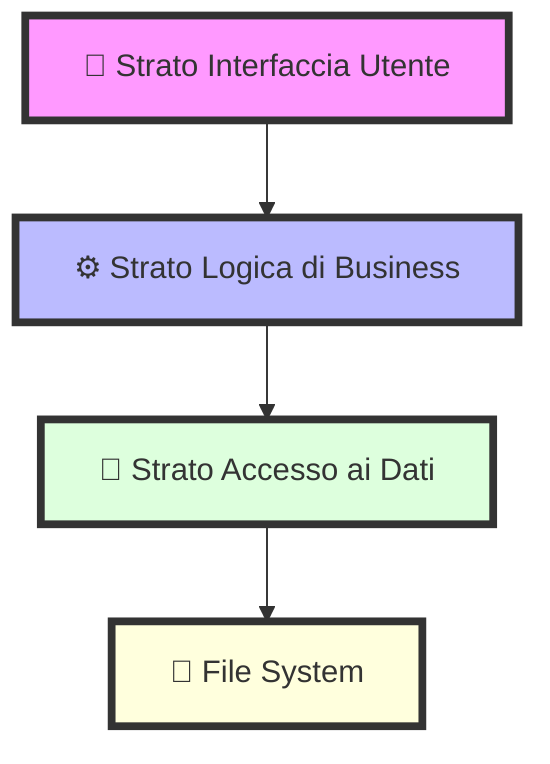

# 🔧 La Nostra Architettura Tecnica

Ciao sviluppatore! 👋 Questo documento ti guiderà attraverso gli aspetti tecnici del nostro sistema di car sharing. Abbiamo cercato di rendere tutto chiaro e accessibile, pur mantenendo il rigore tecnico necessario.

## 🏗️ Come Abbiamo Costruito il Sistema

### La Nostra Architettura a Strati
Immagina il sistema come una torta a tre strati, dove ogni strato ha un compito specifico:



### I Mattoni del Sistema
1. 🎨 **Strato Interfaccia Utente**
   - Gestisce tutto ciò che l'utente vede e tocca
   - Si occupa dei menu e dei messaggi
   - Raccoglie e mostra i dati in modo elegante

2. 🧠 **Strato Logica di Business**
   - Il cervello del sistema!
   - Gestisce prenotazioni e conflitti
   - Applica le regole di business
   - Mantiene tutto organizzato

3. 📊 **Strato Accesso ai Dati**
   - Il nostro archivista digitale
   - Salva e recupera i dati
   - Verifica che tutto sia corretto
   - Gestisce gli errori con grazia

## 🎯 Le Nostre Strutture Dati

### Gestione Prenotazioni (Una Coda Intelligente!)
```c
// La nostra coda con priorità - gestisce le prenotazioni come un pro!
typedef struct {
    Prenotazione* heap;    // Un array che cresce quando serve
    int capacita;         // Quanto spazio abbiamo
    int dimensione;       // Quante prenotazioni ci sono
} CodaPrenotazioni;
```

### Catalogo Veicoli (Una Lista che si Snoda)
```c
// La nostra lista di veicoli - flessibile e veloce
typedef struct node {
    Veicolo veicoli;     // I dettagli del veicolo
    struct node* next;    // Il link al prossimo
} *lista;
```

## ⚡ Prestazioni del Sistema

### Quanto Siamo Veloci?
| Cosa Facciamo | Caso Tipico | Caso Peggiore |
|---------------|-------------|---------------|
| Nuova Prenotazione | O(log n) ⚡ | O(log n) ⚡ |
| Cercare un'Auto | O(n) 🚶 | O(n) 🚶 |
| Login Utente | O(1) 🏃 | O(n) 🚶 |
| Cambiare Stato | O(1) 🏃 | O(n) 🚶 |

### Quanto Spazio Usiamo?
- 📊 Prenotazioni: Cresce con il numero (O(n))
- 🚗 Veicoli: Uno spazio per auto (O(n))
- 👥 Utenti: Un posto per persona (O(n))
- 💾 File: Crescono con i dati (O(n))

## 💾 Come Gestiamo i Dati

### I Nostri File
- 📅 `prenotazioni.txt`: Tutte le prenotazioni
- 👤 `utenti.txt`: Chi può usare il sistema
- 🚗 `veicoli.txt`: Le nostre auto disponibili

### Come Salviamo Tutto
- ✨ Salvataggio automatico dopo ogni modifica
- 🔄 Caricamento veloce all'avvio
- 🔒 Backup di sicurezza alla chiusura
- 📝 Gestione intelligente dei nomi con spazi

## 🔒 Sicurezza Prima di Tutto!

### Protezione Input
- ✅ Controlliamo ogni dato inserito
- 🧹 Puliamo gli input pericolosi
- 🛡️ Gestiamo i caratteri speciali

### Chi Può Fare Cosa
- 🔑 Verifichiamo sempre i permessi
- 👤 Teniamo traccia delle sessioni
- 🔐 Proteggiamo i dati sensibili

## 🧪 Come Testiamo Tutto

### Test delle Singole Parti
```c
// Esempio di test per le prenotazioni
void test_inserimento_prenotazione() {
    CodaPrenotazioni* coda = inizializza_coda();
    Prenotazione p = crea_prenotazione(1, 1, 0, 10, 0, 12, 1);
    assert(aggiungi_prenotazione(coda, p) == 0);  // Deve funzionare!
    assert(coda->dimensione == 1);                // Dimensione corretta?
}
```

### Test del Sistema Intero
- 🎭 Proviamo scenari complessi
- 🤹 Gestiamo conflitti di prenotazione
- 💾 Verifichiamo che i dati si salvino
- 🔄 Testiamo flussi completi

## 💡 Suggerimenti per gli Sviluppatori
- Usa i commenti per capire meglio il codice
- Segui le convenzioni di naming
- Testa sempre le tue modifiche
- Chiedi aiuto se serve - siamo un team!

Buon coding! 🚀✨ 