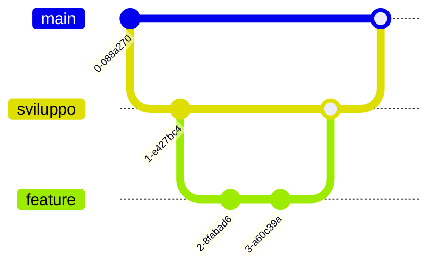

# 📝 Note di Sviluppo

## 🎯 Best Practices

### 1. Gestione Memoria
- Utilizzo corretto di malloc/free
- Controllo memory leak
- Deallocazione risorse
- Gestione buffer overflow

### 2. Stile di Codifica
- Indentazione consistente
- Nomi variabili descrittivi
- Commenti appropriati
- Modularità del codice

### 3. Gestione Errori
- Controlli null pointer
- Validazione input
- Gestione eccezioni
- Log errori dettagliati

## 🚀 Miglioramenti Futuri

### 1. Funzionalità
- Sistema di notifiche
- Interfaccia grafica
- Sistema pagamenti
- Gestione recensioni
- Statistiche utilizzo

### 2. Tecnici
- Migrazione a database SQL
- API REST
- Autenticazione OAuth
- Supporto multi-threading
- Sistema di cache

### 3. UX/UI
- Interfaccia web
- App mobile
- Modalità scura
- Localizzazione
- Accessibilità

## 🐛 Debug e Testing

### Strumenti
- GDB per debug
- Valgrind per memory leak
- Framework test unitari
- Test di integrazione
- Test di sistema

### Procedure
1. Test unitari per componenti
2. Test integrazione moduli
3. Test sistema completo
4. Test di carico
5. Test di sicurezza

## 📈 Metriche e Prestazioni

### Indicatori Chiave
- Tempo di risposta sistema
- Utilizzo memoria
- Operazioni al secondo
- Tasso di errori

### Ottimizzazioni
- Cache risultati
- Indicizzazione dati
- Ottimizzazione query
- Gestione pool di memoria

## 🔄 Flusso di Lavoro Git

### Strategia Branch

### Convenzioni Commit
- funz: nuove funzionalità
- fix: correzioni bug
- doc: documentazione
- stile: formattazione
- refactor: ristrutturazione
- test: aggiunta test

## 🛡️ Checklist Sicurezza

### Validazione Input
- [ ] Sanitizzazione input
- [ ] Prevenzione SQL injection
- [ ] Validazione parametri
- [ ] Escape caratteri speciali

### Autenticazione
- [ ] Hashing password
- [ ] Gestione sessioni
- [ ] Controllo accessi
- [ ] Limitazione richieste

### Protezione Dati
- [ ] Crittografia dati sensibili
- [ ] Operazioni file sicure
- [ ] Strategia backup
- [ ] Conformità privacy

## 📚 Risorse Utili

### Documentazione
- Guida Programmazione C
- Documentazione Git
- Best Practices Sicurezza
- Design Pattern in C

### Strumenti
- Visual Studio Code
- Compilatore GCC
- Sistema Build Make
- Valgrind Memory Checker

### Librerie
- Libreria Standard C
- Strutture Dati
- Gestione File
- Gestione Tempo 